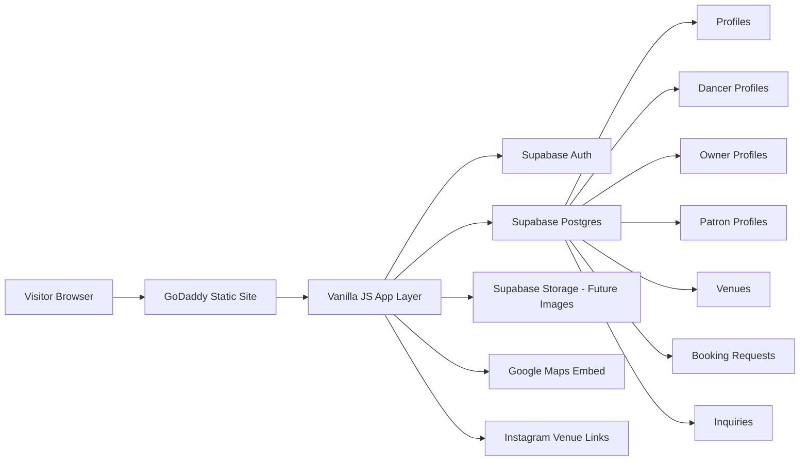

# xxxotic v1

Marketing site **and** registration / booking MVP for **xxxotic**, the
nightlife platform connecting **dancers**, **club / lounge owners**, and
**patrons**. Dark-themed, responsive, vanilla HTML/CSS/JS with **Supabase**
as the backend. Designed to deploy as a static bundle on GoDaddy.

Repo: <https://github.com/Enwakaez/xotic-v1>

---

## What's in this MVP

- 19 HTML pages — marketing, account, and booking flows
- Supabase Auth signup / login / logout
- Role-based dashboard for dancers, owners, and patrons
- Public dancer profile (`dancer-profile.html?slug=...`)
- Patron-initiated booking requests
- Edit-profile flow per role
- Live featured-venues feed (with static fallback)
- Inquiries inserted into Supabase (with Formspree fallback)
- Atlanta venue data: Magic City, Pin Ups, Blue Flame, Strokers, Onyx
- Defensive degradation — when Supabase isn't configured, every
  auth-aware page shows a "Backend not configured" banner instead of
  silently failing

---

## Tech stack

- **HTML5 / CSS3 / Vanilla JavaScript** — no build step
- **Supabase** — Postgres, Auth, Storage (loaded via the public CDN
  `@supabase/supabase-js@2`)
- **Google Fonts** — Montserrat + Pacifico
- **Google Maps** — public key-less embed for the Locations page

---

## Local setup

```bash
git clone https://github.com/Enwakaez/xotic-v1.git
cd xotic-v1

# any static server works
python -m http.server 3000
# then visit http://localhost:3000
```

Without Supabase configured, every marketing page works; auth-aware pages
show the config banner.

---

## Supabase setup

See [`backend/README.md`](backend/README.md) for the full walk-through.
Short version:

1. Create a Supabase project.
2. Run [`backend/supabase-schema.sql`](backend/supabase-schema.sql) in the
   SQL editor.
3. Run [`backend/seed.sql`](backend/seed.sql) to insert the five featured
   Atlanta venues.
4. Create two test users via the dashboard
   (see [`docs/testing-users.md`](docs/testing-users.md)) and re-run
   `seed.sql` to populate their profile rows.
5. Open [`js/config.js`](js/config.js) and replace the two placeholders
   with your project's URL and anon key.
6. Reload the site. Signup / login / dashboard / dancer-profile pages now
   talk to your Supabase project.

The anon key is safe in browser code. Do **not** paste a service-role
key into `js/config.js` — keep it on the server side only.

---

## Architecture



The "Vanilla JS App Layer" is three small files:

- `js/config.js` — Supabase URL + anon key, creates the global client
- `js/api.js` — typed-ish helpers around every table
- `js/auth.js` — signup / login / session helpers + the config banner

Auth-aware pages load all three before `js/main.js`. Marketing pages
that don't need auth (`index.html`, `dancers.html`, `pricing.html`,
etc.) keep their existing single `main.js` script and stay light.

---

## User roles

| Role        | Required at signup                                            | Optional                          |
| ----------- | ------------------------------------------------------------- | --------------------------------- |
| Patron      | first/last name, phone, email, password                       | city, state, interests            |
| Dancer      | first/last name, phone, email, password                       | stage name, city, state           |
| Club Owner  | first/last name, phone, email, password,                      | website / Instagram, inquiry msg, |
|             | club name, business address, business phone, business email   | selected plan (from /pricing)     |

---

## Data flows

### Registration

1. User chooses a role on `signup.html`.
2. JS validates role-specific required fields + password.
3. Supabase Auth creates the `auth.users` row.
4. The app inserts the matching row into `profiles`.
5. The app inserts a role-specific row into `patron_profiles`,
   `dancer_profiles`, or `owner_profiles`. For dancers, a unique slug is
   generated from the stage name (or first+last+UUID suffix).
6. The app logs an `audit_events` row for `signup`.
7. The user is redirected to `dashboard.html`.

### Login

1. `login.html` calls `supabase.auth.signInWithPassword`.
2. On success the user is redirected to `dashboard.html`.
3. If a session already exists when `login.html` mounts, the user is
   redirected straight to the dashboard.

### Dashboard

1. `dashboard.html` calls `auth.requireSession` — if no session, it
   redirects to `login.html`.
2. It fetches the matching `profiles` row.
3. It renders one of three role views (patron / dancer / owner).
4. Each view fetches the role-specific extension and any related rows
   (booking requests for patron + dancer, owner profile + plan for
   owner).

### Booking

1. A patron lands on `dancer-profile.html?slug=<slug>`.
2. The app fetches the public dancer profile (`is_public = true`).
3. If the patron is logged in as a patron, a booking form is shown.
4. Submit inserts a `booking_requests` row.
5. The patron sees the request in their dashboard immediately.
6. The dancer sees it in their dashboard's inbound list and can accept,
   decline, or mark complete.

If the patron isn't logged in, the booking section shows links to log
in or create a patron account. If they're logged in as a non-patron
role, they're shown a "switch to a patron account" message instead.

### Sharing

1. Dancer logs in, marks their profile public, and copies their link
   from the dashboard (Web Share API or clipboard fallback).
2. Anyone with that link can open the public profile.
3. Patrons book directly from the shared link.

### Owner flow

1. From `pricing.html`, each plan card links to
   `signup.html?role=owner&plan=starter|growth|premium`.
2. Signup captures both the role and the plan.
3. The plan is stored in `owner_profiles.selected_plan`.
4. The owner dashboard shows the chosen plan; `edit-profile.html` lets
   the owner change it.

### Inquiries

The four no-account forms (For Dancers, For Club Owners, For Patrons,
Brand Ambassador) submit into the `inquiries` table when Supabase is
configured. If it isn't, they fall back to Formspree (when an action URL
is set in `js/main.js`'s `FORMSPREE_ENDPOINTS` map).

---

## Project structure

```
xotic-v1/
|-- index.html
|-- dancers.html
|-- dancer-profile.html      # public dancer profile + booking form
|-- signup.html              # role-aware signup -> Supabase Auth
|-- login.html               # email + password login
|-- dashboard.html           # role-routed dashboard
|-- edit-profile.html        # role-routed profile editor
|-- for-dancers.html         # marketing + inquiry form
|-- for-club-owners.html     # marketing + inquiry form
|-- for-patrons.html         # marketing + waitlist form
|-- pricing.html
|-- locations.html           # static cards + live Supabase venues
|-- help.html
|-- download.html
|-- store.html
|-- blog.html
|-- payment-processing.html
|-- about.html
|-- brand-ambassador.html    # marketing + application form
|-- terms.html
|-- privacy.html
|-- css/
|   `-- styles.css
|-- js/
|   |-- config.js            # Supabase URL + anon key + client
|   |-- api.js               # database helpers
|   |-- auth.js              # auth + signup helpers + config banner
|   `-- main.js              # nav, dropdown, carousel, forms, maps
|-- backend/
|   |-- supabase-schema.sql  # full schema + RLS + triggers
|   |-- seed.sql             # featured venues + sample profile rows
|   `-- README.md            # Supabase walk-through
|-- docs/
|   `-- testing-users.md     # sample_dancer + sample_patron
|-- assets/
|   `-- img/
|-- ASSETS.md
|-- README.md
|-- AGENTS.md
`-- NEXT_PROMPT.md
```

---

## Data model

| Table              | Purpose                                                                |
| ------------------ | ---------------------------------------------------------------------- |
| `profiles`         | Base account row, one per auth user, with role + contact fields        |
| `patron_profiles`  | Patron extension: city, state, interests                               |
| `dancer_profiles`  | Public dancer details: slug, bio, services, availability, is_public    |
| `owner_profiles`   | Club owner business + selected pricing plan                            |
| `venues`           | Clubs and lounges. Featured rows are public.                           |
| `dancer_venues`    | A dancer's appearances at a venue                                      |
| `booking_requests` | Patron-initiated booking requests sent to a dancer                     |
| `inquiries`        | Generic non-account form submissions                                   |
| `audit_events`     | Lightweight event log (signup, profile_publish, booking_create, ...)   |

Every table has Row Level Security on. See
[`backend/supabase-schema.sql`](backend/supabase-schema.sql) for the
full policy set.

---

## Deployment notes (GoDaddy)

This bundle is fully static. To deploy:

1. Configure `js/config.js` with production Supabase URL + anon key.
2. Upload the entire repo to your GoDaddy hosting root (or a sub-path)
   via cPanel / FTP. Exclude `.git/`, `node_modules/`, and any files
   you don't want public.
3. Test the live URL — the auth-aware pages will use your hosted
   Supabase project automatically.

You don't need a Node runtime, a build step, or a server-side API
because Supabase is the API. RLS is the security boundary.

---

## Security notes

- Never commit a Supabase **service role** key. Only the **anon** key
  belongs in `js/config.js`.
- RLS is the real security boundary; client-side validation is for UX.
- Public dancer profiles only expose what the dancer marks `is_public`.
- Booking requests are only readable by the patron who sent them and
  the dancer who received them.
- Owner business details aren't exposed to anonymous clients.
- Inquiries can be inserted by anyone but never read from the browser.
- Audit events are never read from the browser.

---

## Legal / compliance notes

- `terms.html` and `privacy.html` are **drafts** and need legal review
  before launch.
- The Help page includes a Safety / Human Trafficking resources section.
  The "Get Help" button intentionally opens a search for the National
  Human Trafficking Hotline so users always reach the most current
  verified contact info.
- No explicit imagery is bundled. See [`ASSETS.md`](ASSETS.md) for the
  image replacement plan.

---

## Remaining work

See [`AGENTS.md`](AGENTS.md) and [`NEXT_PROMPT.md`](NEXT_PROMPT.md) for
the running checklist. Highlights:

- Set real Supabase URL + anon key in production
- Wire real App Store / Google Play URLs in `js/main.js`
- Replace dancer roster placeholder photos and add hero / feature
  imagery (see `ASSETS.md`)
- Add web analytics
- Legal review of `terms.html` and `privacy.html`
- Profile photo / venue photo upload (Supabase Storage scaffolding
  ready)

---

## License

Copyright (C) xxxotic Inc. All rights reserved.
